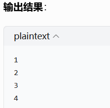
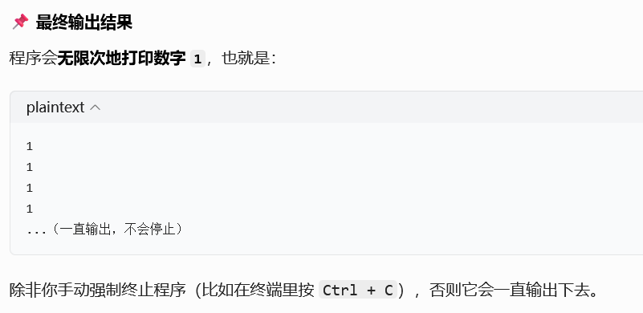

# 一.while循环
## 1.概念
    while循环也叫条件循环，先判断条件是否成立，
    条件为True时，执行循环体，条件为False时，跳出循环。 
## 2.语法
```python
# 1.初始化变量
number = 1
# 2.while关键字+边界条件+英文冒号
while number < 5:
    # 3.循环体（缩进的代码块）
    print(number)
    # 4.条件更新（关键！防止死循环）
    number += 1
```
## 3.输出结果
<p align="left">
  
</p>

# 二.for循环
## 1.概念
    for循环也叫计数循环，他先初始化一个变量，   
    然后根据变量的值，判断是否继续执行循环体。 
 
## 2.语法
```
# 1.初始化变量
number = 1
# 2.for关键字+变量名+in+可迭代对象+英文冒号
for number in range(5):
    # 3.循环体（缩进的代码块）
    print(number)
```
## 3.输出结果

# 三.for循环VSwhile循环
|对比维度|	for 循环|while 循环|
|:--:|:--:|:--:|
|终止条件	|遍历完可迭代对象（列表、字符串等）|边界条件不成立时终止
|适用场景	|已知循环次数、遍历序列|未知循环次数，靠条件控制循环
|常见用法	|遍历列表、字符串，固定次数循环|条件判断循环（如用户输入、状态检测）

    两者在很多场景下可以互相替换，但 while 循环
    更适合 “不知道要循环多少次，只知道什么时候停止” 的场景。
# 四.死循环
## 1.概念
    死循环是指循环体中的条件永远为True，导致循环无法跳出。
## 2.案例
```python
number = 1
while number < 5:
    print(number)
    # 这里没有更新 number 的值！
```
## 3.输出结果
<p>
  
</p>

## 4.如何避免死循环？
    必须在循环体内更新条件相关的变量，让边界条件有机会变为 False
    避免在 while 后写永远为 True 的条件（如 while True: 且没有 break）

# 五.跳出循环
## 1.概念
    跳出循环是指在循环过程中，通过 break 语句或 continue 语句，提前结束循环。
    break 语句：跳出当前循环，继续执行循环体下方的代码。
    continue 语句：跳过当前循环体，继续执行下一次循环。
    注意：break 语句和 continue 语句不能同时使用。
## 2.案例
### （1）使用 break 语句跳出循环，当 number 为 3 时，跳出循环。
```python
number = 1
while number < 5:
    if number == 3:
         break
    print(number)
    number += 1
```
输出结果：
 ```
    1
    2
 ```
### （2）使用 continue语句跳出循环，当 number 为 3 时，跳过当前循环，继续执行下一次循环。
 ```python
number = 1
while number < 5:
    if number == 3:
        number += 1
        continue
    print(number)
    number += 1
```
输出结果：
 ```
    1
    2
    4
 ```


注意：  
break 语句只能跳出当前循环，不能跳出所有循环。<br/>continue 语句只能跳过当前循环，不能跳过所有循环。<br/>break终止当前这一层循环，跳出循环体；多层循环里，仅退出所在层，外层循环继续执行。<br/>continue跳过本轮循环剩下的代码，直接进入下一轮循环，不会跳出循环。


